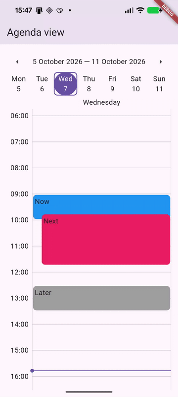
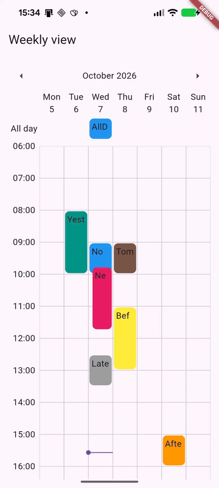
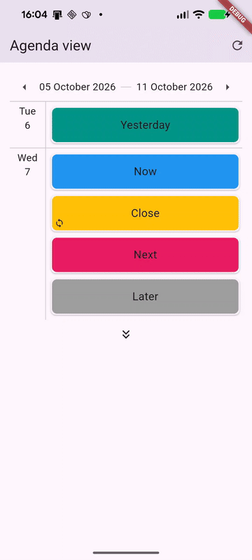
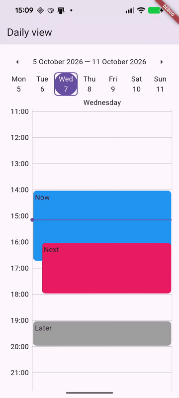

# calendar

A Flutter calendar package built from scratch, with infinite bidirectional scrolling, snap physics, pinch-to-zoom time grids, direct drag & resize editing, recurring events and multi-source event management.

<p align="center">
  
  
  
</p>


## Features

- **Two widgets**: `Calendar` (daily, weekly and monthly time grids) and `Agenda` (scrollable event list).
- **Customizable date schemes** that define which days the weekly and monthly views show.
- **Date-picker header** that adapts to the active date scheme and the calendar view.
- **Infinite scrolling** in both directions, built on a centered `CustomScrollView`, with no fixed three-page `PageView` window.
- **Snap physics** that lands on day or week boundaries, with support for pages of variable size (e.g. month views).
- **Pinch-to-zoom** on the time grid, which changes the minutes-to-pixels ratio.
- **Drag & drop**: long-press an event to move it, including across days with automatic paging at the edges.
- **Resize**: double-tap an event to show its handles, then drag the start or end.
- **Swipe actions** on agenda items, with custom left and right backgrounds.
- **Auto-scroll** while dragging near the edges of the viewport, both vertically (time) and horizontally (dates).
- **All-day row** in a floating, pinned header whose height animates with the number of all-day events on the visible page.
- **Recurring events** with daily, weekly, monthly and yearly patterns, exceptions, moved occurrences and RRULE import/export.
- **Multiple sources** merged into one view, each with its own label, color and visibility toggle.
- **Cached event source** that expands recurrences per day and updates incrementally on insert, modify and remove.
- **Date utilities**: `Date`, `Week`, `Month`, `Year` and `Time` types with arithmetic and comparison operators, plus time zone conversion.
- **Configurable** layout, styling, callbacks and per-event permissions, with custom event and header builders.

## Installation

<!-- TODO: replace with the real source (pub.dev, git or path) -->

```yaml
dependencies:
  calendar:
    git:
      url: https://github.com/marcobrasini/flutter_calendar.git
```

```dart
import 'package:calendar/calendar.dart';
```

If you work with recurring events stored in UTC, or import RRULEs, initialize time zones once at startup:

```dart
Future<void> main() async {
  WidgetsFlutterBinding.ensureInitialized();
  await TimeZones.initialize();            // device time zone
  // await TimeZones.initialize('Europe/Rome');
  runApp(const MyApp());
}
```

## Quick start

```dart
final source = CalendarSource<Event>(
  events: [
    Event(
      id: 'review',
      start: DateTime(2026, 10, 7, 10, 0),
      stop: DateTime(2026, 10, 7, 11, 30),
      color: Colors.teal,
      subject: 'Design review',
      location: 'Room 2',
    ),
  ],
);

Calendar<Event>(
  source: source,
  view: CalendarView.weekly,
  onEventTap: (event) => debugPrint(event.subject),
  onEventDragged: (event, fixture) {
    source.modifyEvents([event.set(fixture.get())]);
  },
  onEventResized: (event, fixture) {
    source.modifyEvents([event.set(fixture.get())]);
  },
);
```

---

## Events

### `Fixture`

A `Fixture` is a time span: `start` and `stop`. It is what drag, resize and swipe callbacks hand back to you as the new placement of an event.

```dart
final slot = Fixture(start: DateTime(2026, 10, 5, 9), stop: DateTime(2026, 10, 5, 10));

slot.duration;                              // 1:00:00
slot.isAllDay;                              // false
slot.dates;                                 // [2026-10-05]
slot.spans(Date(2026, 10), Date(2026, 11)); // true
slot.spans(Date(2026, 9), Date(2026, 10));  // false
```

If `stop` is omitted, it defaults to midnight of the next day, which makes the fixture an all-day span.

| Getter | Meaning |
|---|---|
| `duration` | `stop - start` |
| `dates` | Every calendar day the span touches. |
| `isAllDay` | Both ends fall exactly on midnight. |
| `isSpanned` | Lasts at least one day and does not end at the next midnight. |
| `spans(from, to)` | Whether the span overlaps `[from, to)`. Either end can be `null`. |

### `Event`

`Event` extends `Fixture` with display and recurrence data. Events are immutable: every change returns a new instance.

```dart
final event = Event(
  id: 'lunch',
  start: DateTime(2026, 10, 7, 12, 30),
  stop: DateTime(2026, 10, 7, 13, 30),
  color: Colors.orange,
  subject: 'Lunch with Anna',
  location: 'Osteria',
);

final later = event.set({'start': event.start.add(const Duration(hours: 1)),
                         'stop':  event.stop.add(const Duration(hours: 1))});
final copy  = event.copy();
final map   = event.get();   // {'id': ..., 'start': ..., 'stop': ..., 'color': ..., ...}
```

| Field | Type | Notes                                           |
|---|---|-------------------------------------------------|
| `id` | `String?` | Required for any event stored in a source.      |
| `start`, `stop` | `DateTime` | `stop` defaults to the next midnight (all-day). |
| `color` | `Color` | Slot background.                                |
| `subject` | `String` | Displayed text.                                 |
| `location` | `String?` | Information on the event location.              |
| `parentId` | `String?` | Links an occurrence to its recurring series.    |
| `pattern` | `Pattern?` | Recurrence rule.                                |

Events compare by value (`Equatable`), so `modifyEvents` skips events that did not actually change.

### Event types

An event's role is determined by which of `id`, `pattern` and `parentId` are set:

| Type | `id` | `pattern` | `parentId` | What it is |
|---|:-:|:-:|:-:|---|
| `occurrence` | ✓ | — | — | A plain, one-off event. |
| `recurrence` | ✓ | ✓ | — | The definition of a recurring series. |
| `instance` | — | ✓ | ✓ | One generated occurrence of a series. Never stored, only displayed. |
| `exception` | ✓ | — | ✓ | A single occurrence of a series that was moved or edited. |
| `deviation` | ✓ | ✓ | ✓ | A recurring branch that diverges from its parent series. |

Use `event.type` or the `isOccurrence`, `isRecurrence`, `isInstance`, `isException` and `isDeviation` getters. `parent.owns(event)` tells whether an event is the parent itself or one of its generated instances.

### Recurring events

Attach a `Pattern` to make an event repeat:

```dart
final standup = Event(
  id: 'standup',
  start: DateTime(2026, 10, 5, 9, 30),
  stop: DateTime(2026, 10, 5, 9, 45),
  color: Colors.indigo,
  subject: 'Stand-up',
  pattern: Pattern(
    type: PatternType.weekly,
    recurrences: [Date(2026, 10, 5), Date(2026, 10, 7), Date(2026, 10, 9)],  // Mon, Wed, Fri
    until: DateTime(2026, 12, 19),
  ),
);
```

| Parameter | Meaning |
|---|---|
| `type` | `daily`, `weekly`, `monthly` or `yearly`. |
| `step` | Interval between periods: `step: 2` with `weekly` means every other week. |
| `count` | Stop after this many occurrences. |
| `until` | Stop after this date and time. |
| `exceptions` | Occurrence start times to skip. |
| `recurrences` | Which days inside each period: weekdays for `weekly`, days of the month for `monthly`, month and day for `yearly`. Empty means "same as the series start". |

Monthly and yearly patterns skip dates that do not exist, such as the 31st in a 30-day month or February 29th in a non-leap year.

`event.expand(from, to)` returns the generated instances in a range. You rarely need it directly, because sources expand recurrences for you. A pattern with neither `count` nor `until` is unlimited, and `expand(null, null)` returns nothing for it.

#### RRULE import and export

```dart
final pattern = Pattern.fromICSString(
  'RRULE:FREQ=WEEKLY;INTERVAL=2;COUNT=10\nEXDATE:20261019T093000Z',
);
pattern.toICSString();  // RRULE:FREQ=WEEKLY;INTERVAL=2;COUNT=10\nEXDATE:...
```

Supported properties are `FREQ`, `INTERVAL`, `COUNT`, `UNTIL` and `EXDATE`. `UNTIL` and `EXDATE` are read as UTC and converted to local time, and written back as UTC. `recurrences` is not serialized: `BYDAY`, `BYMONTHDAY` and `BYMONTH` are neither read nor written.

---

## Sources

### `CalendarSource`

A `CalendarSource` holds the events and serves them to the widgets day by day. It is a `ChangeNotifier`: the calendar rebuilds when it notifies.

```dart
final work = CalendarSource<Event>(
  events: initialEvents,
  label: 'Work',
  color: Colors.blue,
  visible: true,
  cacheRange: 1,
);
```

Every event must have a non-null `id`.

#### Mutations

| Method | Effect | Notifies |
|---|---|:-:|
| `insertEvents(events)` | Adds events whose `id` is not present yet. | ✓ |
| `modifyEvents(events)` | Replaces events with the same `id`, skipping unchanged ones. | ✓ |
| `removeEvents(events)` | Removes events by `id`. | ✓ |
| `sync(events)` | Makes the source match `events` exactly, adding, replacing and removing as needed. Returns `true` if anything changed. | — |
| `set(events)` | Replaces everything and drops the cache. | — |
| `clear()` | Removes everything and drops the cache. | — |

The three main mutations take an optional `notify` flag, so you can batch several changes and notify once:

```dart
source.removeEvents(stale, false);
source.insertEvents(fresh);   // single rebuild
```

`sync` is meant for reconciling with a backend after a fetch: only the events that actually differ touch the cache.

#### Queries

| Member | Returns |
|---|---|
| `forDate(date)` | Events on that day, recurrences expanded, sorted by start then by longest first. |
| `find(id)` | The stored event with that `id`, or `null`. |
| `events` | All stored events (series definitions, not instances). |
| `dates` | Days currently in the cache. |
| `hasBefore(datetime)`, `hasAfter(datetime)` | Start of the week of the nearest event before or after `datetime`, or `null`. |

#### Caching

`forDate` loads whole months around the requested day: `cacheRange` months on each side, aligned to full weeks. Moving forward or backward loads only the new days and evicts the ones that fall out of range. Each cached day stores its expanded, sorted instances, so scrolling does not re-expand patterns.

Mutations update the cache in place: an inserted or modified event is expanded only over the cached range, and a removed or replaced event also removes all its generated instances.

#### Visibility

```dart
work.visible = false;   // notifies; hidden in any CalendarSources that contain it
```

### `CalendarSources`

Combines several sources into one view:

```dart
final sources = CalendarSources<Event>({
  CalendarSource<Event>(label: 'Work', color: Colors.blue, events: workEvents),
  CalendarSource<Event>(label: 'Personal', color: Colors.green, events: homeEvents),
});

Calendar<Event>(source: sources, view: CalendarView.weekly);
```

Queries merge the **visible** sources. Mutations are routed explicitly, because the aggregate cannot know which source a new event belongs to:

```dart
sources.source('Work').insertEvents([meeting]);   // add to a specific source
sources.owner(event.id!)?.modifyEvents([edited]); // edit wherever it lives
sources.find(id);                                  // search all sources

sources.attach(newSource);
sources.detach(oldSource);
```

Calling `insertEvents`, `modifyEvents`, `removeEvents`, `set` or `sync` directly on `CalendarSources` throws `UnsupportedError`.

---

## Widgets

### `Calendar`

Time grid for the `daily`, `weekly` and `monthly` views.

```dart
Calendar<Event>(
  source: source,
  view: CalendarView.weekly,
  scroll: CalendarScroll.snapping,           // default
  dateScheme: const DateScheme(0, 5),        // Monday to Friday
  timeScheme: const TimeScheme(8, 20, step: TimeStep.minutes30),
  draggableEvent: true,                      // default
  resizableEvent: true,                      // default
  onEventDragged: (event, fixture) { /* ... */ },
  onEventResized: (event, fixture) { /* ... */ },
);
```

### `Agenda`

Scrollable list of events, organized by dates and weeks like a to-do list.

Because of this structure, events usually come with swipe actions for dismiss-style operations (e.g. complete, archive, delete). The widget also supports a dedicated scroll mode, `CalendarScroll.sequential`, which loads only limited chunks of days that contain events instead of every day in the range.

```dart
Agenda<Event>(
  source: source,
  view: CalendarView.weekly,
  scroll: CalendarScroll.sequential,
  swipeableEvent: true,                      // default
  leftSwipeBuilder: (context) => const ColoredBox(color: Colors.red),
  rightSwipeBuilder: (context) => const ColoredBox(color: Colors.green),
  onEventSwipedLeft: (event, fixture) => source.removeEvents([event]),
  onEventSwipedRight: (event, fixture) { /* ... */ },
  emptyBuilder: (context) => const Text('No events'),
);
```

### Common parameters

| Parameter | Calendar | Agenda | Description                                                                                                                 |
|---|:-:|:-:|-----------------------------------------------------------------------------------------------------------------------------|
| `source` | ✓ | ✓ | A `CalendarSource` or `CalendarSources`.                                                                                    |
| `view` | ✓ | ✓ | `CalendarView.daily`, `weekly` or `monthly`.                                                                                |
| `scroll` | ✓ | ✓ | `CalendarScroll.continuous`, `sequential`, `individual` or `snapping`.                                                      |
| `dateScheme` | ✓ | ✓ | Days per page.                                                                                                              |
| `timeScheme`, `weekScheme` | ✓ | | Hours and week rows.                                                                                                        |
| `headerConfig`, `eventConfig`, `clockConfig`, `dateConfig`, `lineConfig` | ✓ | ✓ | Styling (see Customization).                                                                                                |
| `timeConfig`, `weekConfig` | ✓ | | Time column and week row labels.                                                                                            |
| `headerBuilder`, `eventBuilder` | ✓ | ✓ | Custom header and event widgets.                                                                                            |
| `cornerBuilder` | ✓ | | Top-left corner above the time column.                                                                                      |
| `draggableEvent` | ✓ | ✓ | Enables drag & drop.                                                                                                        |
| `resizableEvent` | ✓ | | Enables resize.                                                                                                             |
| `swipeableEvent` | | ✓ | Enables swipe actions.                                                                                                      |
| `showFrame`, `showHeader`, `showHeaderWidget`, `showHeaderButton`, `showIndicator` | ✓ | ✓ | Toggle grid lines, header, all-day row, arrows and the current-time indicator.                                              |
| `fixLastAnchor`, `fixNextAnchor`, `lastAnchorBuilder`, `nextAnchorBuilder` | | ✓ | Set the visibility and the form of the anchor widgets used for loading events in the `sequential` scrolling of the `Agenda`. |
| `shrinkableAgenda`, `negligibleAgenda`, `centredView` | | ✓ | Configure the visibility of the widgets in the `Agenda`.                                                                    |
| `emptyBuilder` | | ✓ | Shown when there are no events.                                                                                             |

---

## Editing events



A calendar widget is most useful when it lets users manage and edit events. This package supports that through basic gestures: each gesture fires a callback, and drag, resize, and swipe operations report their result when they end.

### Gestures

| Gesture | Effect |
|---|---|
| Tap | Fires `onEventTap` and closes any open editor. |
| Double tap | Fires `onEventDoubleTap` and, if the event is resizable, opens the resize editor. |
| Long press | Fires `onEventLongPress` and, if the event is draggable, starts dragging it. |
| Drag a handle | Resizes the event by moving its start or end. |
| Swipe (agenda) | Fires `onEventSwipedLeft` or `onEventSwipedRight` if the event is swipeable. |
| Tap outside | Closes the open editor. |

While dragging, the event stays under the finger regardless of what the layout beneath it does, whether it scrolls, changes page, or the all-day header changes height. The drop is resolved against the layout at the moment the finger lifts. Holding the pointer near an edge scrolls the time axis or pages to the previous or next dates.

### Callbacks

| Callback | Signature | When |
|---|---|---|
| `onEventTap`, `onEventDoubleTap`, `onEventLongPress` | `(T event)` | A gesture on an event. |
| `onFrameTap`, `onFrameDoubleTap`, `onFrameLongPress` | `PageCallback` | A gesture on an empty part of the grid. |
| `onEventDragged` | `(T event, Fixture fixture)` | A drag was dropped on a valid target. |
| `onEventResized` | `(T event, Fixture fixture)` | A resize was released on a valid range. |
| `onEventSwipedLeft`, `onEventSwipedRight` | `(T event, Fixture fixture)` | An agenda item was swiped. |

These callbacks let you control exactly how events are handled and customize the interaction. For example, you can open a details dialog in `onEventTap`, or create a new event in `onFrameLongPress`.

Drag, resize, and swipe callbacks fire only when the corresponding `draggableEvent`, `resizableEvent`, or `swipeableEvent` flag is on. The calendar never changes the source on its own: persisting the new `fixture` is up to you, which makes optimistic updates and server confirmation straightforward.

For recurring events, the `event` you receive is usually a generated **instance**. See [Editing a recurrence](#editing-a-recurrence).

### Editing an occurrence

Plain occurrences and exceptions have their own `id`, so you can write the new `fixture` straight back to the source:

```dart
onEventDragged: (event, fixture) {
  if (event.isOccurrence || event.isException) {
    source.modifyEvents([event.set(fixture.get())]);
  }
},
```

### Editing a recurrence

When you edit a recurring event through the calendar, you only work with its instances. To change the series, retrieve the original recurrence from the source using the instance's `parentId`, then operate on the recurrence itself. When an instance is dragged or resized, you can either move the whole series or move only that occurrence (see [Moving an instance](#moving-an-instance)).

#### Moving the whole series

Changing the recurrence's start or end affects every occurrence. Don't copy the instance's new times onto the recurrence: that would move the start of the series itself. Shift it by the same offset instead:

```dart
onEventDragged: (event, fixture) {
  if (event.isInstance) {
    final recurrence = source.find(event.parentId!)!;
    // Don't do this: it would move the series start to this instance's new start.
    // source.modifyEvents([recurrence.set({'start': fixture.start, 'stop': fixture.stop})]);
    final offset = fixture.start.difference(event.start);
    source.modifyEvents([recurrence.shift(offset, fixture.duration)]);
  }
},
```

#### Other changes to the series

All event helpers return a new event rather than modifying the original, so write the result back to the source:

```dart
source.modifyEvents([recurrence.addException(DateTime(2026, 10, 12, 9, 30))]);  // skip one
source.modifyEvents([recurrence.delException(DateTime(2026, 10, 12, 9, 30))]);  // restore it
source.modifyEvents([recurrence.addRecurrence(Date(2026, 10, 8))]);             // add Thursdays
source.modifyEvents([recurrence.setPattern(recurrence.pattern!.setCount(20))]); // limit the series
```

#### Moving an instance

Generated instances have no `id`, so they cannot be stored as they are. To move only one occurrence, skip it in the series and store an exception in its place:

```dart
onEventDragged: (event, fixture) {
if (event.isInstance) {
final recurrence = source.find(event.parentId!)!;
final exception = Event.make(
id: newId(), // your id generator
data: event.exception(fixture).get(),
);
source.modifyEvents([recurrence.addException(event.start)], false);
source.insertEvents([exception]);   // single rebuild
}
},
```

`event.deviation(fixture)` works the same way, but keeps the pattern, so the new event starts a recurring branch of its own.

### Per-event permissions

The global flags can be refined per event:

```dart
Calendar<Event>(
source: source,
view: CalendarView.weekly,
eventConfig: EventConfig(
draggable: (event) => !event.isInstance,       // series occurrences stay put
resizable: (event) => !event.isAllDay,
),
);
```

---

## Schemes

Schemes describe the shape of a page.

```dart
const TimeScheme(8, 20, step: TimeStep.minutes30, ratio: 1.5);
const DateScheme(0, 5);       // 5 days starting from Monday
const WeekScheme(0, 6);       // 6 week rows
```

| Scheme | Parameters | Meaning |
|---|---|---|
| `TimeScheme(beg, end)` | `step`, `ratio`, `round` | Visible hours, grid line interval (`TimeStep.minutes15` … `hours24`), initial pixels per minute, rounding in minutes. |
| `DateScheme(beg, end)` | `step` | Day offsets shown on each page and how many days a swipe moves (defaults to the page width). |
| `WeekScheme(beg, end)` | | Week rows shown in the monthly view. |

Defaults per view:

| View | `dateScheme` | `timeScheme` | `weekScheme` |
|---|---|---|---|
| `daily` | `DateScheme.daily()` | `TimeScheme.allDay()` | — |
| `weekly` | `DateScheme.weekly()` | `TimeScheme.allDay()` | — |
| `monthly` | `DateScheme.weekly()` | — | `WeekScheme.general()` |

---

## Customization

All config objects are immutable, have nullable fields, and are merged over the package defaults: set only what you want to change.

### `EventConfig`

```dart
EventConfig(
padding: 4.0,
margin: 1.0,
rounded: 6.0,
maxLines: 2,
overflow: TextOverflow.ellipsis,
textStyle: const TextStyle(fontSize: 12),
textStyleOf: (event) => TextStyle(
color: event.color.computeLuminance() > 0.5 ? Colors.black : Colors.white,
),
duration: const Duration(milliseconds: 200),   // slot animations
draggable: (event) => true,
resizable: (event) => true,
swipeable: (event) => true,
);
```

`textStyleOf` is merged on top of `textStyle`, so you can set a base style and adjust it per event.

### `eventBuilder`

Replaces the default slot content (subject and recurrence icon):

```dart
eventBuilder: (context, event) => Padding(
padding: const EdgeInsets.all(4),
child: Column(
crossAxisAlignment: CrossAxisAlignment.start,
children: [
Text(event.subject, style: const TextStyle(fontWeight: FontWeight.w600)),
if (event.location != null) Text(event.location!),
],
),
),
```

### Header

```dart
headerConfig: HeaderConfig(
textStyle: Theme.of(context).textTheme.titleMedium,
background: Theme.of(context).colorScheme.surfaceContainer,
),
headerBuilder: (context, first, last) => Text('$first – $last'),
```

### Other configs

| Config | Fields |
|---|---|
| `LineConfig` | `style` (`solid` or `dashed`), `color`, `width`, `length`, `offsetX`, `offsetY`, `dashedWidth`, `dashedSpace` |
| `ClockConfig` | `period` (indicator refresh), `radius`, `width`, `color` |
| `TextConfig` (`dateConfig`, `timeConfig`, `weekConfig`) | `format` (`intl` pattern), `padding`, `textStyle`, `background` |

Colors left unset are taken from the current `Theme`.

---

## Date utilities

The package ships small calendar types built on `DateTime`:

```dart
final today = Date.now();
today + 1;                 // tomorrow
today - 7;                 // a week ago
today % Date(2026, 1, 1);  // days between
today.toWeek.mon;          // Monday of this week
today.toMonth.last;        // last day of the month
today & Time(14, 30);      // DateTime on that day at 14:30

Time(9, 0) + 90;           // 10:30
Time(9, 7).round(15);      // 09:00

Week.now().first;          // Monday
Month(2026, 2).days;       // 28
Year(2028).isLeapYear;     // true
```

| Type | Arithmetic unit | Comparison |
|---|---|---|
| `Time` | minutes | by hour and minute |
| `Date` | days | by day |
| `Week` | weeks | by week (Monday start) |
| `Month` | months | by month |
| `Year` | years | by year |

All types support `+`, `-`, `%` (distance), `<`, `>`, `<=`, `>=` and value equality. Any `DateTime` converts with `.date`, `.time`, `.toWeek`, `.toMonth` and `.toYear`. `format(pattern)` uses `intl` and capitalizes each word.

`toTZ([location])` converts a UTC instant to wall-clock time in a time zone, and `fromTZ([location])` does the reverse. Both default to the zone set by `TimeZones.initialize`.

---

## Architecture notes

- **Infinite scroll**: two `SliverList`s around a `center` key. After each snap, the scroller rebases (`jumpTo` plus shifting the metrics) so offsets stay small.
- **Semantic and physical state**: `CalendarViewer` holds the current view and date, `CalendarScroller` the scroll position. The scroll view can rebase itself without the visible date jumping.
- **Picker**: the header's `CalendarPicker` follows the viewer. When it has the same view as the viewer, it mirrors it without duplicating steps or notifications.
- **Snap physics**: `SnapPhysics` picks the target page from the release position and the projected fling distance, moving at least one page in the gesture direction and at most `maxPages`.
- **Editor overlay**: the resize editor follows the time grid through a `CompositedTransformFollower`. The dragged slot is drawn in screen coordinates instead, so layout changes underneath do not move it.
- **Pointer tracking**: edits are driven through `GestureBinding.instance.pointerRouter`, so a gesture survives the rebuilds and page changes it causes.

## License

<!-- TODO -->
